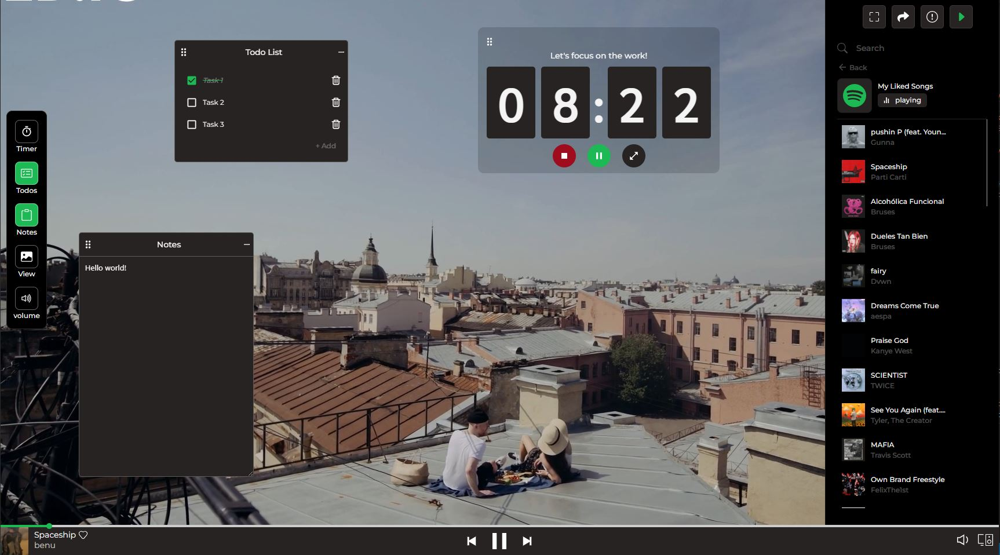

# Pomotify

Pomotify is a simple **Fullstack** Pomodoro timer app with Spotify integration. As a Pomodoro technique user and Spotify lover, I would love to have this kind of application. With Spotify in the web, users can focus on their study/work while listening to some playlists without the need to open their Spotify app.

## Techstacks

### Frontend

* React
* Styled-Components
* Material-UI
* Framer-Motion

### Backend

* Node.j
* Express

### API

* Spotify API

### Deployment

* Vercel (Serverless)

## Ongoing/Future Works

* Bugs fixes